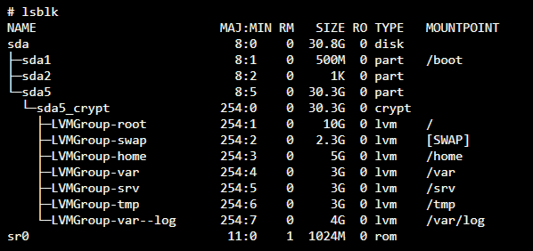
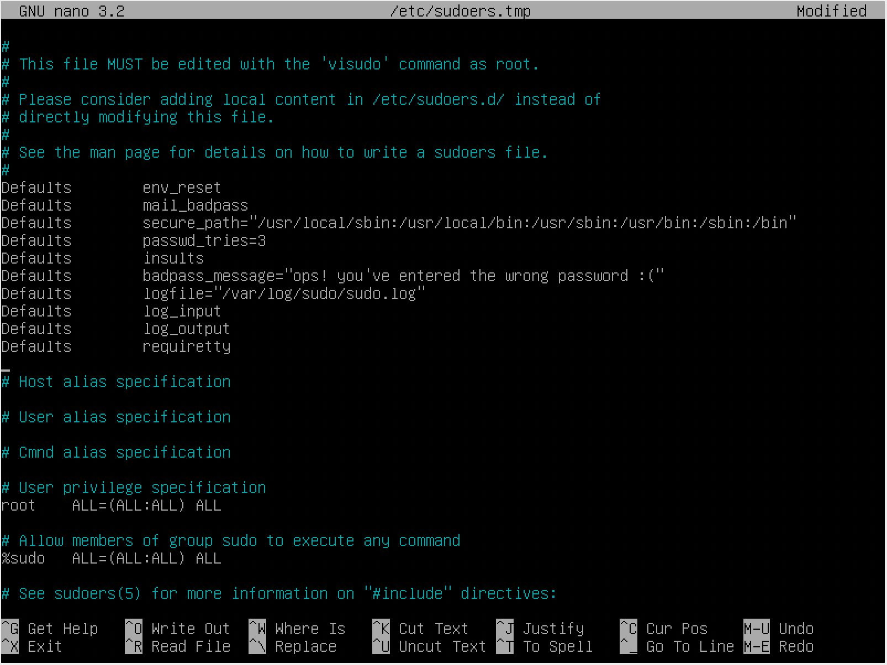
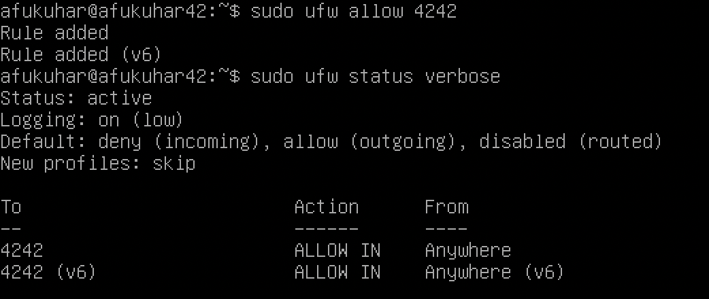
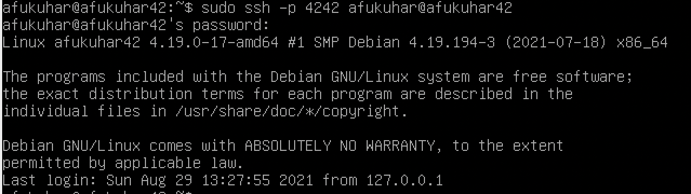
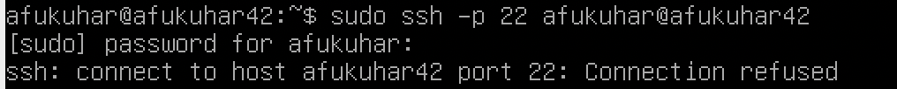
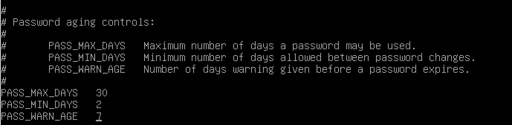
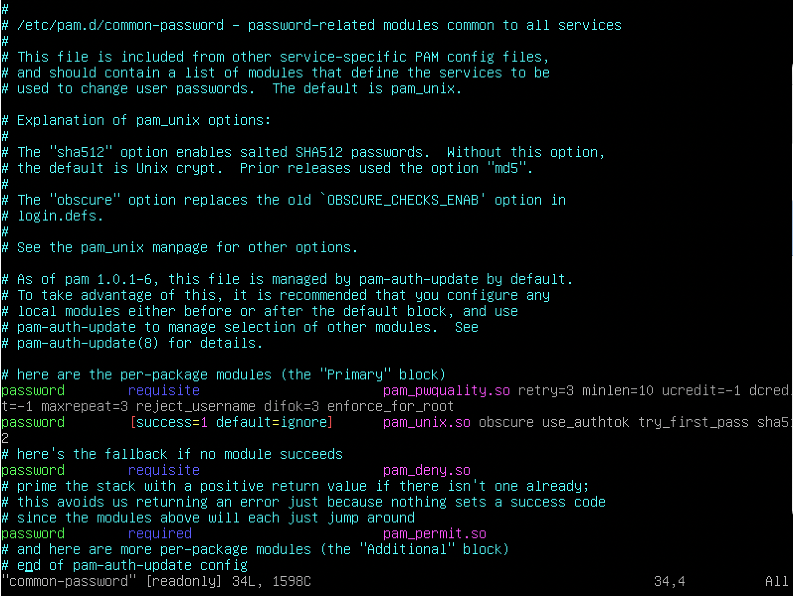

# Born2beRoot


## Introduction
This project aims to introduce you to the wonderful world of virtualization.
This is my first Virtual Machine in VirtualBox under specific instructions. At the end of this project I will be able to set up my own operating system implementing strict rules

## Requirements
* Operating System: Debian 
* Encrypted partitions using LVM (Logical Volume Manager)
* Operating system configured with UFW firewall leaving only port 4242 open
* SSH service running on port 4242 only and block root to connect using it
* Implementation of strong password policy
* Installation and configuration of sudo using strict rules
* In addition to root user, a user with my username present which belogs to sudo and user42 groups
* Creation of simple script called monitoring.sh, developed in bash. At startup the script should display some info in all terminals every 10 minutes.

## Work Flow
1. Installing **Virtual Box** <br  /><br  />
	Oracle VM VirtualBox is a free and open-source hosted hypervisor for x86 virtualization, developed by Oracle Corporation. It enables you to run more than one OS at a time. The download file is available [here](https://www.virtualbox.org/wiki/Downloads).<br  /><br  />
2. [Download](https://www.debian.org/distrib/netinst) **Debian ISO**. The one I used was amd64 image ;) <br  /><br  />
	Debian, also known as Debian GNU/Linux, is a Linux distribution composed of free and open-source software, developed by the community-supported Debian Project, which was established by Ian Murdock on August 16, 1993. It is an operating system for a wide range of devices including laptops, desktops and servers. Users like its stability and reliability since 1993. We provide reasonable default configuration for every package. The Debian developers provide security updates for all packages over their lifetime whenever possible.
	The image downloaded will be used to install the OS at our Virtual Machine in VBox :)<br  /><br  />
3. **Installing Debian on Virtual Machine**<br  /><br  />
	In order to install Debian in your Virtual Machine and setup encrypted partitions using LVM, I followed [this](https://www.youtube.com/watch?v=2w-2MX5QrQw) youtube video. The video teaches you to set up partitions as it is required on Bonus part :)<br  /><br  />
	Settings in VBox while creating a new virtual machine:
	* OS: Debian 64 bit
	* Memory(RAM): 1024 MB
	* Hard disk file type: VDI (VirtualBox Disk Image) 8GB
	* Storage in physical hard disk: dynamically allocated
	* Network attached to bridged adapter (to be able to use ssh into de VM)
	<br  /><br  />
	
	Configs while installing debian on first startup of VM:<br  />
	* Language/Country/Keymap/timezone
	* Hostname: <username>42
	* Root password
	* New user (username and password)
	* Manual Disk partition (in order to create the encrypted partitions using LVM - Logical Volume Manager like following image)<br  />
	<br  /><br  />

4. **SUDO**<br  /><br  />
	Sudo (Super-user do) is a program designed to let system administrators allow some users to execute some commands as root (or another user). The basic philosophy is to give as few privileges as possible but still allow people to get their work done. Sudo is also an effective way to log who ran which command and when.
	* Installation
		```bash
		sudo apt-get install sudo 
		```
	* Configuration
		- Authentication using sudo has to be limited to 3 attempts in the event of an incorrect password.
		- A custom message of your choice has to be displayed if an error due to a wrong password occurs when using sudo.
		- Each action using sudo has to be archived, both inputs and outputs. The log file has to be saved in the /var/log/sudo/ folder.
		- The TTY mode has to be enabled for security reasons.
		- For security reasons too, the paths that can be used by sudo must be restricted.

		In order to achieve these configurations, we should edit sudo configuration file. We can easily access it with `sudo visudo`. Access [sudoers manual](https://www.sudo.ws/man/1.8.14/sudoers.man.html) to understand all possible configurations in sudo.<br  /><br  />
		<br  /><br  />
5. **[UFW](https://help.ubuntu.com/community/UFW%0A) firewall**<br  /><br  />
	UFW is a program for managing a netfilter firewall. Developed to ease iptables firewall configuration, ufw provides a user friendly way to create an IPv4 or IPv6 host-based firewall. By default UFW is disabled.<br  />
	UFW will be used to configure our OS and leave only port 4242 open. UFW must be active when the virtual machine is launched.
	* Installation
		```bash
		sudo apt-get install ufw
		```
	* Enabling it
		```bash
		sudo ufw enable
		```
	* Check status
		```bash
		sudo ufw status verbose
		```
	* Configure ports
		```bash
		sudo ufw allow 4242
		```
		<br  /><br  />
6. **Users and groups manipulation**<br  /><br  />
	It is required that the additional user is assigned to sudo and user42 groups. Also, in the middle of the defense of the project we will be asked to create a new user and assign it to a group.
	* Create new user
	```bash
	sudo adduser <username>
    ```
	* Add user to a group
	```bash
	sudo adduser <username> <group_name>
    ```
	* Add new group
	```bash
	sudo groupadd <group_name>
    ```
	* Change user password
	```bash
	sudo passwd <username>
    ```
	* Current user
	```bash
	whoiam
    ```
	* See current user groups
	```bash
	groups
    ```
7. **SSH**<br  /><br  />
	Secure Shell is a cryptographic network protocol for operating network services securely over an unsecured network. Typical applications include remote command-line, login, and remote command execution, but any network service can be secured with SSH.
	* Installation
		```bash
		sudo apt install open-ssh client
		sudo apt install open-ssh server
		```
	* Configuring SSH service to run only in port 4242<br  />
		The file which determines the port for ssh service is `sshd_config`. Inside this file you will see a commented line with `Port 22`. Uncomment it and change to `4242` :)<br  />
		Also, for security reasons, we should block ssh connections as root by editing or adding `PermitRootLogin no`
		After changing the config file, you will need the restart ssh service.<br  />
		```bash
		sudo systemctl restart ssh
		```
		<br  />
		By the end you should be able to connect using ssh through port 4242:<br  />
		<br  /><br  />
		But the service will be refused if tried with any other port:<br  />
		<br  /><br  />
		When trying to login to root, you will see a `Permission Denied` message.<br  />
		<br  /><br  />
8. **Strong Password Policy**
	* Password aging<br  />
		- Your password has to expire every 30 days.
		- The minimum number of days allowed before the modification of a password will be set to 2.
		- The user has to receive a warning message 7 days before their password expires.<br  /><br  />

		We can change `/etc/login.defs` to change these configs:<br  />
		<br  />
		obs: Be aware that this will apply only for future created users. To change to current ones you will need to do it one by one:<br  />
		```bash
		sudo chage -M 30 -m 2 -W 7 <username>
		```
		<br  />
		To check the status of a user:<br  />

		```bash
		sudo chage -l <username>
		```

		<br  />
	* Complexity<br  />
		- Your password must be at least 10 characters long. It must contain an uppercase letter and a number. Also, it must not contain more than 3 consecutive identical characters.
		- The password must not include the name of the user.
		- The password must have at least 7 characters that are not part of the former password.
		- Of course, your root password has to comply with this policy.<br  />
		<br  />
	We are gonna install [libpam-pwquality](https://linux.die.net/man/8/pam_pwquality). This module can be plugged into the password stack of a given service to provide some plug-in strength-checking for passwords. And that is what we are gonna do to enforce our user's passwords ;)<br  /><br  />
		Installation<br  />
		
		```bash
		sudo apt install libpam-pwquality
		```

		Edit config file `/etc/pam.d/common-password`<br  />
		<br  /><br  />

9. **montoring.sh**


